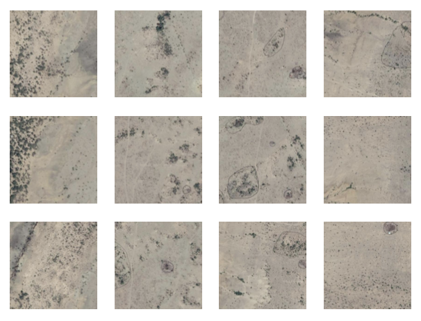

# Maasai Skywatch
by 
Luke McKinley, Rhys Broussard, & Michael Hasey

------------------------------------------------
## Problem Statement

 

Government officials and foreign companies in Tanzania and Kenya are using ecotourism and conservation laws to displace indigenous Maasai people, evicting them and denying them access to watering holes and vital grazing for their livestock.  We want to use computer vision to provide the Maasai with a tool to quickly identify illegal village burns, forced migrations, & potential land grabs.

##### 
source: [google earth](https://www.google.com/earth/studio/) / [maxar](https://www.maxar.com)

 

## Executive Summary

 

A semi-nomadic ethnic group, the Maasai are based in the Great Rift Valley of East Africa, between Northern Tanzania and Southern and Central Kenya.  With a population of almost 2 million, they have inhabited the region for centuries, moving their herds of cattle with the seasons.

Using satellite / aerial imagery data to train and apply an object detection model in [Roboflow](https://roboflow.ai) for Maasai regions in the Great Rift Valley, our objective is to create a secure, reliable, and unbiased source of information to reduce social injustice.

We used high-resolution Google Earth Studio captures to gather data while maintaining metadata.  Using [labelImg](https://github.com/tzutalin/labelImg), we set bounding boxes around current and former Maasai architectures (villages, corrals, farms, burned villages) before augmenting with color, rotation, and random noise.  Applying our data to a YoloV3 model (via Roboflow), we were able to correctly identify Maasai architecture with 65% accuracy.

__________________________________________________
## Next Steps

 

The insights we hope to make available to the Maasai include statistics on dispersal, village count, density and land-use issues over time.  Additionally, secure, real-time data about illegal village burnings and evictions.

##### 
