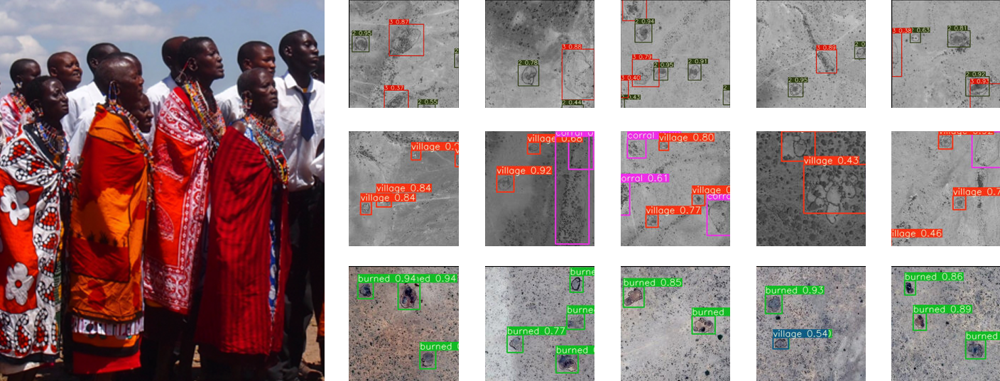
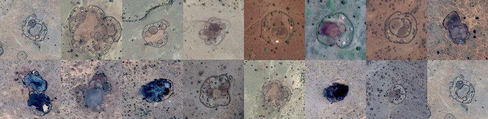
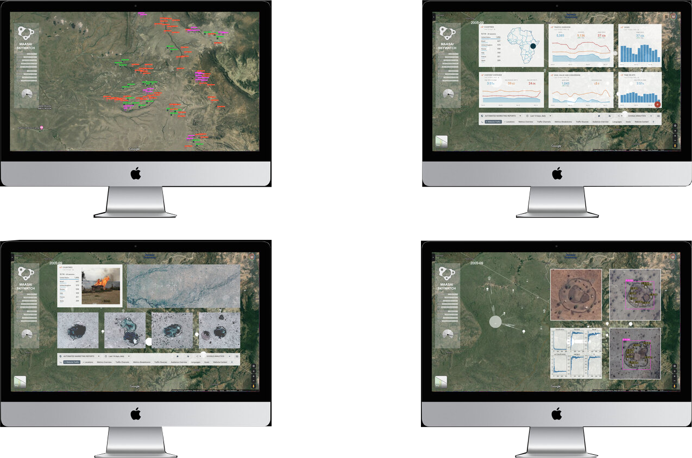

# Maasai Skywatch
### Detecting Illegal Village Burns and Other Spatial Injustices

------------------------------------------------
by 
Michael Hasey, Luke McKinley, Rhys Broussard


## Summary

<br>

Maasai Skywatch is a proposed online tool that uses publicly available satellite imagery and sophisticated object-detecting algorithms to identify and locate illegal village burns and land-related injustices against the Maasai people.

<br>



## Project Page

<br>

```
www.michaelhasey.com/maasai-skywatch
```

## Table of Contents

<br>

- [Background](#Background)
- [Dataset](#Dataset)
- [Model](#Model)
- [Performance](#Performance)
- [References](#References)
- [Citation](#Citation)

## Background

<br>

A semi-nomadic ethnic group, the Maasai are based in the Great Rift Valley of East Africa, between Northern Tanzania and Southern and Central Kenya.  With a population of almost 2 million, they have inhabited the region for centuries, moving their herds of cattle with the seasons.

Government officials and foreign companies in Tanzania and Kenya are using ecotourism and conservation laws to displace indigenous Maasai people, evicting them and denying them access to watering holes and vital grazing for their livestock.  We use computer vision to provide the Maasai with a tool to quickly identify illegal village burns, forced migrations, & potential land grabs.

The advantage of AI assistance is its speed and accuracy.  While it may take multiple weeks for NGO’s, word of mouth and manual village visits to determine the extent of damage,  a combination of AI and “real time” satellite imagery may help to reduce this time to mere hours or minutes.  By providing quick and accurate counts and metrics of land-based injustices with soon after they occur, Maasai Skywatch’s AI technology can one day provide the robust, unbiased, and hard evidence needed to fight many of these social injustices and protect Maasai livelihood and land for many more generations to come.

In addition to identifying land-based injustices, our model can also identify how many individual houses are located within each village, and thus provide an estimated inhabitant count.  As the Maasai are semi-nomadic and do not have fixed addresses, obtaining population counts is often difficult.  By using deep learning methods such as this, population counts can be acquired more quickly and accurately. 

<br>


## Dataset

<br>

In order to detect villag burns, we trained an Object Detection Model on a custom dataset of 600 satellite images of Maasai villages compiled and augmented within Roboflow, a dataset builder application.  Our final training dataset contained images of villages in various states (burned, not burned, etc.) , landscapes (desert, grassland, etc.)  and contexts (dense, not dense, etc.), allowing our model to detect village burns in varying environments and locate instances of potential injustice.  In addition, we taught our model to identify villages, individual house counts within villages, and animal corrals.  

Using [labelImg](https://github.com/tzutalin/labelImg), we set bounding boxes around current and former Maasai architectures (villages, corrals, farms, burned villages) before augmenting with color, rotation, and random noise.  

<br>



## Model

In order to autonomously detect Maasai villages, home burnings, and other injustices from above, we used a sophisticated neural network algorithm called [Yolo-V3](https://github.com/eriklindernoren/PyTorch-YOLOv3).  This model was trained to detect maasai villages and animal corrals, individual houses within villages, and villages that have been burned. 

<br>

For model training, follow the instructions and steps within the provided notebook below

```
maasai-village-notebook.ipynb
```

## Performance

<br>

After training our YoloV3 object detection model, we evaluated its performance by testing it on a series of new images it has never been exposed to before.  These images contained unlabelled Maasai villages, burned villages, and corrals for animals set in a variety of landscapes and contexts.   As indicated below, our trained model properly identified and label these objects and instances with a high degree of accuracy. 

<br>


## Proposed GUI

<br>

A proposed user facing GUI to detect land-based injustices against the Maasai is shown below.  This would allow users to monitor, detect and analyze various land based injustices (village burns, fenced land which may indicate illage land grabs, and forced evictions, etc) as well as conduct population counts and tracking.  

<br>



## References

<br>

1. Yolo-V3 [https://github.com/eriklindernoren/PyTorch-YOLOv3](https://github.com/eriklindernoren/PyTorch-YOLOv3)
2. labelImg[https://github.com/tzutalin/labelImg] (https://github.com/tzutalin/labelImg)

## Citation

<br>

If you find this project useful in your research, please consider citing:

``` 
@misc{mhasey2021,
    title={Maasai Skywatch},
    author={Michael Hasey},
    year={2020},
}
```
